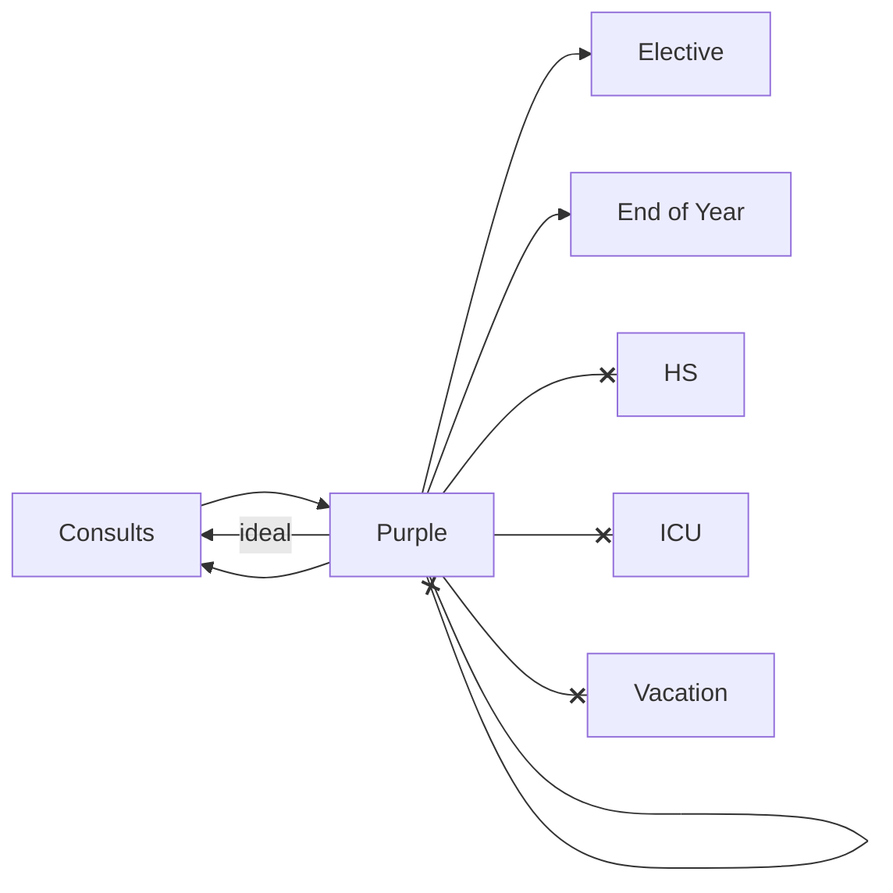

# purple problems

> Status: Possibly completed

## Problem Statement

After review 2/9, observation made that only certain things can follow Purple due to Sunday workday.

Classically takes the form of `Purple -> Consults` which is a natural fit, but could come before Elective or Clinic.

## Solution

Added constraint as above, verified working with real 2026 data.

May be though that desired behavior is P -> Elective|Consults -> P -> Elective|Consults. Will ask for confirmation.